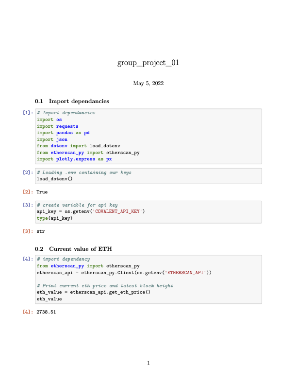
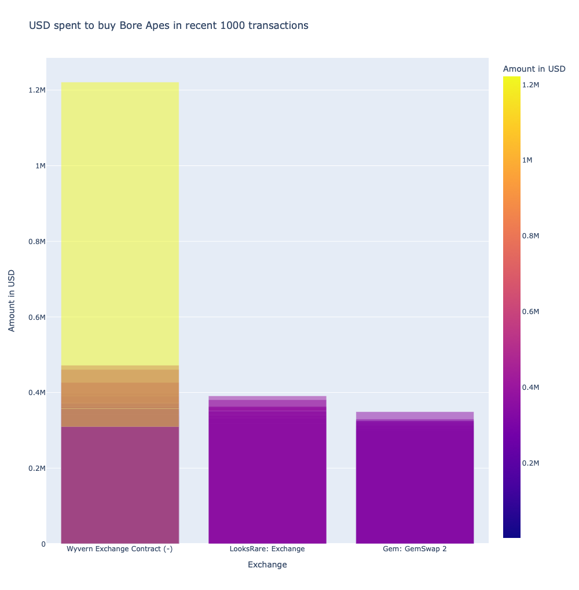
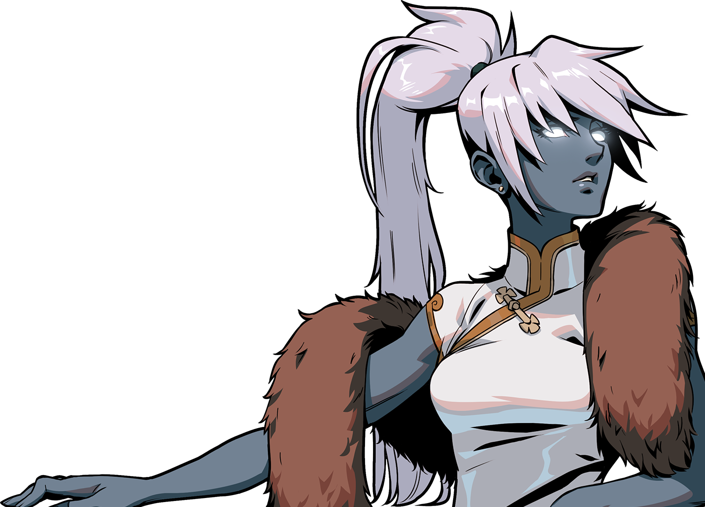
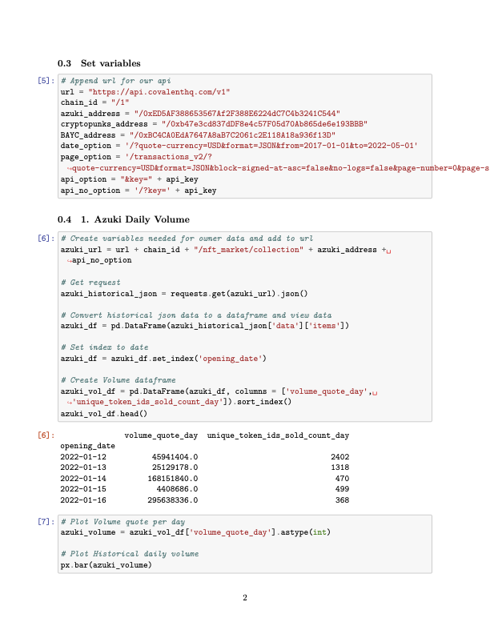
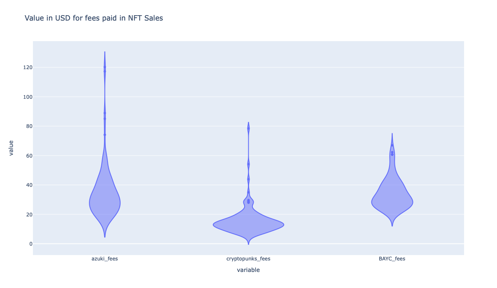
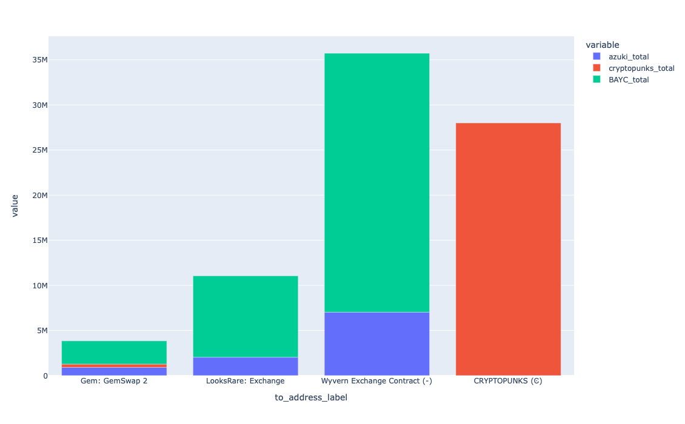
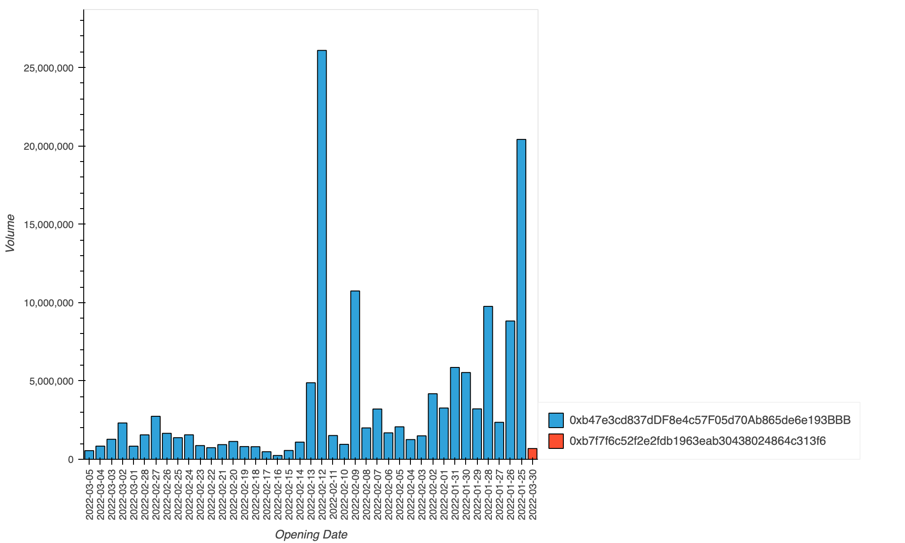
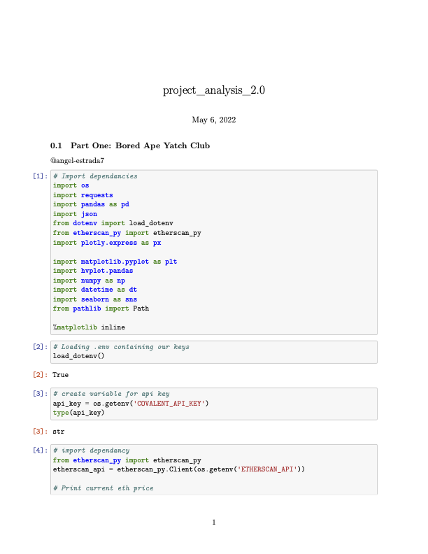

 

## Table of Contents

1. [Project Summary](#1-project-summary)
2. [Hypothesis](#2-hypothesis)
3. [Data Collection & Cleanup](#3-data-collection--cleanup)
4. [Analysis](#4-analysis)
5. [Postmoterm](#5-postmoterm)
6. [Discussion](#6-discussion)
7. [Contributors](#7-contributors)

## 1. Project Summary
* Our project uncovers patterns in NFT trading for three NFT collections.
    * Part One : [*Boyed Ape Yatch Club*](https://boredapeyachtclub.com/)
    * Part Two : [*Azuki*](https://www.azuki.com)
    * Part Three : [*Cryptopunks*](http://larvalabs.com/cryptopunks)
* We'll examine relationships between types of:
    * Art and customers
    * Purchase prices and timestamps
    * Trends in purchases over time
    * Historical Volume 
    * Purchase prices
    * Trends in sales
    * Transaction data ie. transaction fees paid for all collections
    * Other related questions as the data admits

## 2. Hypothesis
* Should you invest in Azuki, BAYC or Crypto Punks? 
    * What are people paying for NFT in USD value?
    * How much in fees are being paid per transaction?
    * Is the value appreciating or declining?
* How can you tell which collection is performing well?
    * What is the daily transaction volume after Collection is released?

## 3. Data Collection & Cleanup
* How do we collect NFT data?
    - [x] Covalent APIs
    - [x] Etherscan API
    - [x] Other Dependancies ie. Plotly Express
    
* Why cleanup data?
    * Prepare data for analysis
    * Isolate the types of data we are interested in from the rest
    * See what the customer data look like
    * Evaluate performance

## 4. Analysis

* What kind of data we like to work with and the field we're interested in 
    * Market Caps
    * Transaction data
    * NFT art trading sales
    * Gas Prices prices
    * Price volatility
    * Collections
    * Token IDs
    * Contract addresses
    * NFT Owners
    * Global view of NFT Marketplace
    * Wrapped tokens
    * Major Exchanges that process NFT transactions

<!---
 
-->

- [x] Part One: Bored Ape Yatch Club @angel-estrada7

    
    

<!---
    
-->

- [x] Part Two : Azuki @mmsaki

    

    
    

    

    

<!--- 

-->

- [x] Part Three: Cryptopunks @dockingbay24

    
    
    
    

## 5. Postmoterm
* Did we find everything we expected to find?
    - [x] What are our difficulties
        * Concating data from multiple data sources
        * Data cleanups
        * Choosing data to plot
        * Selecting appropriate plots to display data
        * Using unfarmiliar libraries
    - [x] How did we deal with them
        * Googling
        * Stackoverflow
        * Reading official documentation
        * Consulting instructor
        * Asking tutors
    - [x] Additional questions that came up  that we would research next if we had more time
        * Global NFT market sales comparison
        * Burned tokens vs Active tokens
        * How can we separate authentic sales from suspicious NFT transactions?
    
## 6. Discussion

* After we've analyzed our data to our satisfaction, we'll put together a presentation to show off our work, explain our process, and discuss our conclusions.
* This presentation will be delivered as a slideshow, and it would give our classmates and instructional staff an overview of our work. 

**File:** [Analysis](./project_analysis_2.0.ipynb)  
**File:** [Project Presentation](./exports/pdf/group_presentation.pdf)

## 7. Contributors 

- [@mmsaki](https://github.com/mmsaki)
    * Project Organisation
    * Document preparations & Analysis
    * Prepare Powepoint Presentation
    * README.md
- [@dockingbay24](https://github.com/dockingbay24)
    * Data Collection
    * APIs selections
    * Merge branching
- [@angel-estrada7](https://github.com/angel-estrada7)
    * Genreal Analysis
    * Assist w/ presentation

